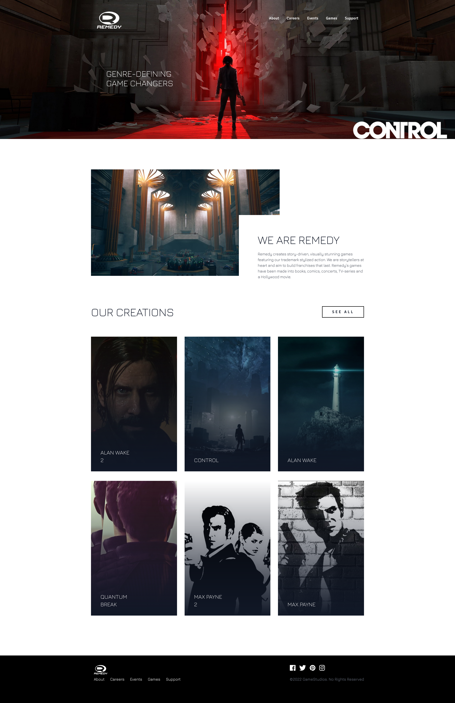
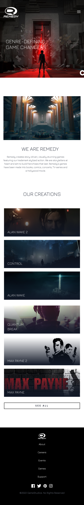
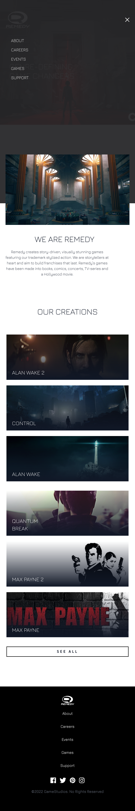

# GameStudios Landing Page
Gamestudios Landing page from Udemy Course: Tailwind CSS from Scratch and from Frontend Mentor Challenge.

It is a website design to showcase the products offered. This project uses Tailwind CLI.

This design features special hamburger menu that envelops the nav bar menu inside and shows a page with it when displayed in mobile screen (or smaller resolution screens). It is achieved using custom CSS classes and DOM via Vanilla JavaScript
## Made Using


## Usage
Install Dependencies:
```
npm install
```
Run Tailwind CLI:
```
npm run watch
```

## Screenshots
### Web-View


### Mobile-View
<p float="left">
    

</p>