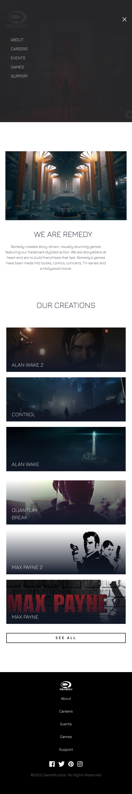

# GameStudios Landing Page
Gamestudios Landing page from Udemy Course: Tailwind CSS from Scratch and from Frontend Mentor Challenge.

It is a website design to showcase the products offered. This project uses Tailwind CLI.

This design features special hamburger menu that envelops the nav bar menu inside and shows a page with it when displayed in mobile screen (or smaller resolution screens). It is achieved using custom CSS classes and DOM via Vanilla JavaScript

The design catalogue items is inspired by the games made by Remedy Entertainment.
## Made Using


## Usage
Install Dependencies:
```
npm install
```
Run Tailwind CLI:
```
npm run watch
```

## Screenshots
### Web-View


### Mobile-View


### Mobile-View with Menu

